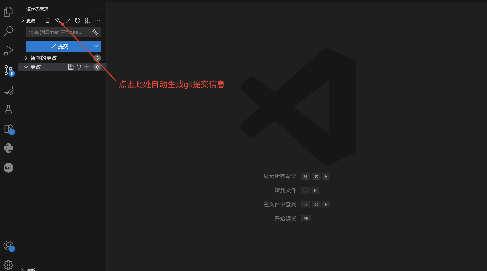

# Hebai AI Git Commit

一个 VS Code 扩展，用 AI 生成 Git 提交信息，并将结果直接写入源码管理输入框。

## 目录

1. [功能特性](#功能特性)
2. [快速开始](#快速开始)
3. [配置指南](#配置指南)
4. [AI 提供商](#ai-提供商)
5. [使用方法](#使用方法)
6. [自定义设置](#自定义设置)
7. [故障排除](#故障排除)
8. [开发说明](#开发说明)

---

## 功能特性

- 支持 OpenAI、OpenAI Responses API、Claude、Gemini
- 点击源码管理标题栏右侧的图标即可生成提交信息
- 固定输出 Conventional Commits 风格的中文提交信息
- 要求模型返回 `git commit -m` 命令，再由扩展提取 `-m` 中的内容写入输入框
- 支持自定义基础请求地址，适配代理、网关和兼容服务

## 快速开始

### 使用步骤

1. 在 Git 仓库中修改代码。
2. 运行 `git add .` 或按需暂存变更。
3. 打开源码管理面板：`Ctrl+Shift+G`。
4. 点击源码管理标题栏右侧的“生成提交信息”按钮。
5. 扩展会调用 AI 生成结果，并把解析后的提交信息写入输入框。



### 首次配置

1. 按 `Ctrl+,` 打开设置，搜索 `Hebai AI Git Commit`。
2. 选择 AI 提供商。
3. 填写基础请求地址、API Key、模型。
4. 回到源码管理面板，点击生成按钮。

---

## 配置指南

当前设置页包含 5 项：

1. `aiProvider`
2. `baseUrl`
3. `apiKey`
4. `model`
5. `enableDebugLogs`

### 1. AI 提供商

可选值：

- `openai`
- `openai-response`
- `claude`
- `gemini`

### 2. 基础请求地址

- 留空时使用各 provider 的默认地址。
- 可用于代理、兼容网关或私有部署。
- 支持环境变量：`AI_BASE_URL`、`OPENAI_BASE_URL`、`CLAUDE_BASE_URL`、`GEMINI_BASE_URL`

### 3. API Key

建议优先使用环境变量：

- `OPENAI_API_KEY`
- `CLAUDE_API_KEY`
- `GEMINI_API_KEY`

### 4. 模型

可直接输入任意模型名称，也可通过环境变量覆盖：

- `OPENAI_MODEL`
- `CLAUDE_MODEL`
- `GEMINI_MODEL`

### 5. 调试日志输出

- 默认关闭。
- 开启后，调试日志会写入 VS Code 输出面板中的 `Hebai AI Git Commit` 通道。
- 最终生成的提交信息和错误日志始终会输出到该通道。

---

## AI 提供商

### OpenAI

- 默认走 `chat.completions`
- 适合大多数 OpenAI 兼容服务

### OpenAI Responses API

- 走 `/v1/responses`
- 仅适用于明确支持 Responses API 的服务
- 如果你的网关只兼容 `/v1/chat/completions`，请改用 `openai`

### Claude

- 通过 `https://api.anthropic.com/v1/messages` 调用
- 支持通过 `baseUrl` 走代理或兼容实现

### Gemini

- 通过 Google Generative Language API 调用
- 支持通过 `baseUrl` 走网关

---

## 使用方法

### 生成流程

1. 读取当前 Git 暂存区 diff。
2. 构造 prompt，请模型返回固定格式的 `git commit -m` 命令。
3. 从命令中解析 `-m` 参数。
4. 将解析后的提交标题和正文写入源码管理输入框。

### 实际示例

模型返回：

```bash
git commit -m "fix(parser): 修复提交信息解析失败问题" -m "修正 -m 参数的正则匹配逻辑，避免标准命令格式无法提取正文"
```

扩展写入输入框的内容：

```text
fix(parser): 修复提交信息解析失败问题

修正 -m 参数的正则匹配逻辑，避免标准命令格式无法提取正文
```

---

## 自定义设置

### 环境变量示例

#### Windows

```cmd
setx OPENAI_API_KEY "your-openai-key"
setx OPENAI_BASE_URL "http://localhost:8000/v1"
setx OPENAI_MODEL "gpt-4o-mini"
```

#### macOS/Linux

```bash
export OPENAI_API_KEY="your-openai-key"
export OPENAI_BASE_URL="http://localhost:8000/v1"
export OPENAI_MODEL="gpt-4o-mini"
```

### 配置示例

#### OpenAI

```json
{
  "hebai-ai-git-commit.aiProvider": "openai",
  "hebai-ai-git-commit.baseUrl": "http://localhost:8000/v1",
  "hebai-ai-git-commit.apiKey": "your-api-key",
	"hebai-ai-git-commit.model": "gpt-4o-mini",
	"hebai-ai-git-commit.enableDebugLogs": true
}
```

#### OpenAI Responses API

```json
{
  "hebai-ai-git-commit.aiProvider": "openai-response",
  "hebai-ai-git-commit.baseUrl": "https://api.openai.com/v1",
  "hebai-ai-git-commit.apiKey": "your-api-key",
	"hebai-ai-git-commit.model": "gpt-4.1-mini",
	"hebai-ai-git-commit.enableDebugLogs": true
}
```

---

## 故障排除

### 按钮不显示

- 确保当前工作区是 Git 仓库。
- 确保你打开的是源码管理视图。
- 如果刚安装扩展，尝试重载窗口。

### `openai-response` 返回 `500 not implemented`

这通常表示你填写的 `baseUrl` 不支持 `/v1/responses`。

处理方式：

- 将 provider 改为 `openai`
- 或换成明确支持 Responses API 的服务

### AI 返回了 git commit 命令，但解析失败

扩展会在 VS Code 输出面板的 `Hebai AI Git Commit` 通道打印：

- `AI 原始返回:`
- `AI 原始返回（标准化后）:`

开启 `enableDebugLogs` 后，可根据这两条日志判断模型是否返回了非标准命令格式。

### 网络连接问题

- 检查基础请求地址是否正确。
- 检查 API Key 是否有效。
- 检查模型名是否与目标服务兼容。

---

## 开发说明

### 技术架构

- OpenAI SDK：用于 OpenAI 和 OpenAI Responses API
- Axios：用于 Claude 和 Gemini
- Prompt 约束：固定要求返回 `git commit -m` 命令
- 解析器：提取 `-m` 参数内容并写入 SCM 输入框

### 项目结构

```text
hebai-ai-git-commit/
├── src/
│   ├── extension.ts                  # 扩展入口与命令注册
│   └── features/
│       └── gitCommit/
│           ├── commands.ts           # 提交信息生成流程
│           ├── config.ts             # VS Code 配置读取
│           ├── diffAnalysis.ts       # Diff 摘要与 scope 分析
│           ├── prompt.ts             # AI 提示词构建
│           ├── aiProviders.ts        # OpenAI/Claude/Gemini/openai-response 调用
│           ├── git.ts                # Git 与 SCM 交互
│           ├── constants.ts          # 功能常量
│           ├── types.ts              # 共享类型
│           └── cleanCommitMessage.ts # AI 输出清洗与命令解析
├── package.json
├── README.md
└── dist/
```

### 编译与调试

```bash
pnpm install
pnpm run build
```

调试扩展时，在 VS Code 中按 `F5` 启动扩展宿主。

### 系统要求

- VS Code 1.102.0+
- Git 已安装并可在命令行中调用
- 当前工作区必须是 Git 仓库

---

## 许可证

MIT